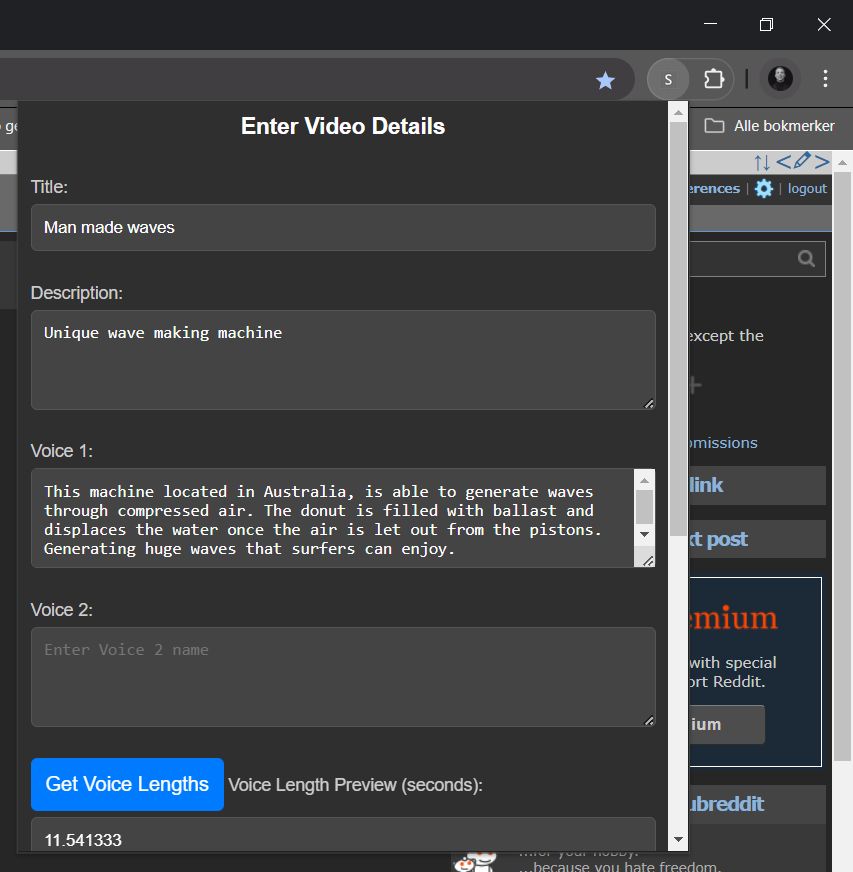

# Video Processing App 🎬🎵  

This project processes videos by merging text, voiceovers, background music, and captions. It allows users to customize voiceovers, video volume, and song selection while ensuring high-quality output.

## Processed Video Example 🎥  
https://https://github.com/Martin-Marelius/YTShorter/showcase/video.mp4  

> *(Click to view the processed video!)*  

## Chrome Extension Preview 🖼️  


## Features ✨  
- **Video Processing**: Combines video, voiceovers, and background music seamlessly.  
- **Voice Length Calculation**: Fetches and displays voice duration before processing.  
- **Audio Customization**: Adjusts volume levels for video and voiceovers.  
- **Random Song Selection**: Picks a random song from the chosen mood category.  
- **Chrome Extension UI**: Saves video metadata and user preferences.  
- **Auto-Save Form Data**: Uses Chrome Storage to persist user inputs.  

## Installation 🛠️  

### Prerequisites  
- [Python](https://www.python.org/) (for backend processing)  
- [FFmpeg](https://ffmpeg.org/download.html)
- [Requirements.txt] TODO

## Usage 🚀

1. Start the backend server:
    ```sh
    python src/app/server.py
    ```
2. Open the Chrome extension by loading the  directory as an unpacked extension in Chrome.
3. Use the extension UI to configure your video processing settings and start processing.

## Contributing 🤝

Contributions are welcome! Please open an issue or submit a pull request for any improvements or bug fixes.

## License 📄

This project is licensed under the MIT License. See the LICENSE file for details.